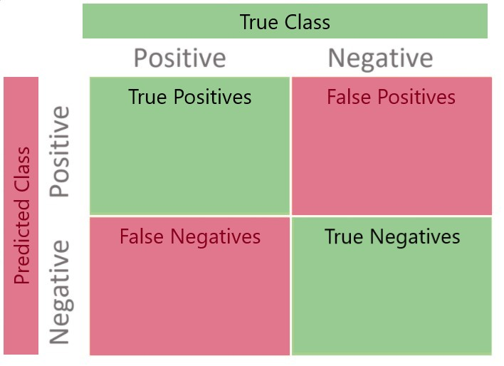
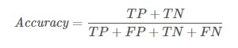
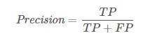
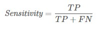
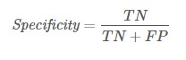

```{r setup, include=FALSE}
knitr::opts_chunk$set(echo = TRUE)
library(tidyverse)
library(imputeTS)
library(caret)
library(pROC)
train <- readr::read_csv('C:/Users/chris/OneDrive/Master Of Data Science - CUNY/Winter 2021/DATA621/Business-Analytics-and-Data-Mining-with-Regression/Titanic Kaggle Blog Dataset/train.csv')
test <- readr::read_csv('C:/Users/chris/OneDrive/Master Of Data Science - CUNY/Winter 2021/DATA621/Business-Analytics-and-Data-Mining-with-Regression/Titanic Kaggle Blog Dataset/test.csv')

train <- train %>% select(Pclass, Sex, Age, SibSp, Parch, Fare, Survived)
test <- test %>% select(Pclass, Sex, Age, SibSp, Parch, Fare)

#train$Survived <- ifelse(train$Survived == 0, "Dead", "Alive")
```

## Introduction

After successfully generating predictions from your classification model, you'll want to know how accurate the predictions are. Accuracy can be a pretty squirrelly concept when it comes to classification models because the metrics that are meaningful to your model will vary based on the purpose of your model. For example, are you trying to predict if a patient has cancer? Or are you trying to predict if a person is male or female? In evaluating both of these models, you would most likely focus on different metrics because, as you can imagine, there are different costs associated with making an incorrect prediction.

To understand these intricacies, let's use these metrics to evaluate a classification model. The data we'll be using comes from Kaggle's well known [*Titanic - Machine Learning from Disaster*](https://www.kaggle.com/c/titanic/data) classification competition. Each row of the dataset describes one of the passengers aboard the Titanic. The purpose of the competition is to use the provided features (such as gender, age, etc.) to predict whether a given passenger lived or died.


## Evaluation Metrics

Without doing any data cleaning or feature engineering, we'll generate a baseline logistic regression model by fitting our model on the training data and then making a prediction on the same dataset. For simplicity, we'll use the features without any missing values and the following metrics to evaluate the accuracy of the model:

-   Confusion Matrix

-   Accuracy

-   Classification Error Rate

-   Precision

-   Sensitivity

-   Specificity

## The Model

```{r echo = FALSE}
train <- imputeTS::na_locf(train)
test <- imputeTS::na_locf(test)
```

We'll fit a logistic regression model to our data using the `Pclass`, `Sex`, `Age`, `SibSp`, `Parch`, and `Fare` columns from the dataset to try and predict `Survived`.

```{r}

log_fit <- glm(Survived ~ ., family = binomial(link = 'logit'), data = train,)
summary(log_fit)

```

Having fit our model, let's now generate our predictions.

```{r}

log_preds <- predict(log_fit, type = 'response')
log_preds <- ifelse(log_preds > 0.5, 0,1)

```

## Evaluating our Model

Now that we have some predictions, we can evaluate the model to determine how well it is predicting the actual class. A key piece in understanding the accuracy of our model is the confusion matrix. To generate one, we'll use the `confusionMatrix` function from the `caret` package. This function requires that we provide our inputs as factors, so we'll make that conversion and display the matrix:

```{r}
train$Survived <- factor(train$Survived, levels = c(1,0), labels = c('Lived', 'Died'))
log_preds <- factor(log_preds, levels = c(1,0), labels = c('Lived', 'Died'))
(caret::confusionMatrix(data = log_preds, reference = train$Survived, positive = 'Lived')$table)
```

In looking at the results above, we can see that our baseline model is not performing very well. The values on the diagonal, going from the top left corner to the bottom right corner, are the classes the model accurately predicted. The column headers indicate the actual class and the row labels indicate the predicted class. It's often easier to understand a confusion matrix with a visual representation:

{width="572"}

As an example, if we look at the first column, ('Lived', 'Lived') which are the true positives, we see that the model correctly identified 108 individuals who lived, however, looking at ('Lived', 'Died') which are false negatives in the bottom left , we see the model predicted that 234 individuals died who actually lived.

The confusion matrix will be critical in understanding the metrics we'll use to evaluate this model.

## Accuracy

Of all the metrics we'll discuss, accuracy is the most straightforward and the one you are probably the most familiar with. When it comes to classification models, accuracy is really just a high level spot check and should almost never be the only metric used to evaluate your model. Accuracy can be calculated using the values from the confusion matrix:



The trouble comes when you have imbalanced classes in your response variable. For example, if you are trying to detect fraud and only 1 out of 1,000 transactions are fraudulent, even if you predict every case as having no fraud, you will still have a model that is 99.9% accurate. However, maybe that one fraudulent case costs millions of dollars in damages. We know that for a model like this, predicting the one fraudulent transaction would be the focus of the model, and that our metrics should be tuned to help us understand how well the model is performing in that regard. As such, in most classification settings, accuracy needs to be broken down even further to analyze how the model is predicting the outcomes we care about.

Let's take a look at the accuracy of our model:

```{r}
accuracy <- confusionMatrix(data = log_preds, reference = train$Survived, positive = 'Lived')$overall[['Accuracy']]

accuracy
```

Our model is really struggling. We are only predicting the actual class \~21% of the time.

## Classification Error Rate

This metric is the opposite of accuracy. It shows us how often our outcomes are being misclassified. It is calculated as follows:


We can find the classification error rate for our model by subtracting our *Accuracy* metric from 1.

```{r}
classification_error <- 1 - accuracy
classification_error
```

Our model is predicting the wrong class \~79% of the time.

## Precision

Precision is looking at the ratio of true positives to the predicted positives. This metric is most often used when there is a high cost for having false positives. For example, in a model that is classifying email as SPAM or HAM, we would want an extremely high precision so that relevant, important emails aren't being sent to the junk folder or blocked (false positives). The cost of a false positive here is high. Precision is calculated as follows:



For our model, we have to stretch the story here a little bit to make precision meaningful. Let's say that we inherited a large sum of money, and being the Titanic history buff that we are, we wanted to send \$1,000 to the family of each survivor as identified by our model. We definitely don't want to send more money than we need to, so we'd really like our model to have high precision, meaning, we are sending money to actual survivor's families as much as possible, and really limiting how often money is sent to families of passengers who died.

Let's look at the precision of our model:

```{r}
confusionMatrix(data = log_preds, reference = train$Survived, positive = 'Lived')$byClass[['Precision']]
```

The precision of our model is atrocious. If we used the model as it is to send our \$1,000 gifts, only \~19% of the families who should receive the gift would get it and the rest of the money we gifted would just be a waste per our objective!

## Sensitivity (Recall)

Sensitivity or recall is important when you are concerned with identifying positive outcomes and the cost of a false positive is low - meaning we are fine picking up some false positives as long as we identify as many actual positives as possible. For example, if you are predicting whether a patient has cancer or not, it is important that the sensitivity be incredibly high so that we can catch the most positive cases possible, even if it means we pull in a few patients who don't actually have cancer. The cost of a false positive here is low. Sensitivity is calculated as follows:



Let's assume we wanted to send a single rose to the family of each survivor as identified by our model. We don't have quite enough money to send a flower to families of both survivors and those who have died, so we've had to make a choice. In our heart of hearts, it's incredibly important to us that we at least get roses to the families of actual survivors, however, we don't mind if we end up sending *some* roses to families where the passenger died. We are buying the roses at Costco in bulk, so they are fairly inexpensive. In this situation, we'd want our sensitivity to be very high so that the most families of survivors possible were getting roses, even if a few families of non-survivors got a rose as well.

Let's calculate the sensitivity of our model:

```{r}
confusionMatrix(data = log_preds, reference = train$Survived, positive = 'Lived')$byClass[['Sensitivity']]
```

The sensitivity of our model is really quite terrible. If we used the model as it stands, only \~31% of the families of survivors would actually get a rose! That's unacceptable!

## Specificity

Specificity is the ratio of true negatives to all negative outcomes. This metric is of interest if you are concerned about the accuracy of your negative rate and there is a high cost to a positive outcome, so you don't want to blow this whistle if you don't have to. For example, if you're an auditor looking over financial transactions and a positive outcome would mean a one year investigation, but not finding one would only cost the company \$50. Specificity is calculated as follows:



Let's say we wanted to send a hand written note to the family of each passenger who died as identified by our model. Since the Titanic sunk in 1912, we feel the families have had time to heal from their loss and so would not be distraught by receiving a note. However, we feel it would be incredibly insensitive to send a note to a family of a survivor, because their death would have been more recent (the last Titanic survivor died in 2009 at age 97) and the family would still be grieving.

Let's calculate the specificity of our model:

```{r}
confusionMatrix(data = log_preds, reference = train$Survived, positive = 'Lived')$byClass[['Specificity']]
```

Our specificity is shameful! Were we to use our current model as it stands, \~86% of note receivers would be made to remember their recent loss! We can't have that!

## Conclusion

In looking at the metrics of our model, one thing is clear: we should not use this model for any type of gift giving. Our model is very inaccurate and will only cause consternation.

While we won't be writing any hand written notes to Titanic survivors based on this exercise, we have learned in a memorable way, some of the most common metrics used for classification models. There are, of course, other important metrics such as F1 Score, ROC Curve, and AUC, however, we'll save that discussion for another day.

## 

## 
