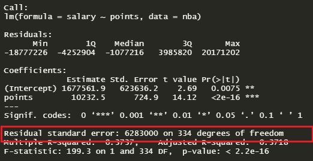
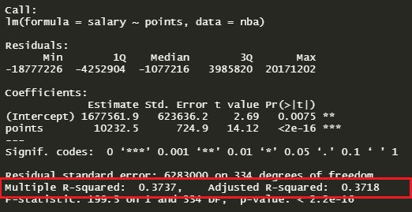
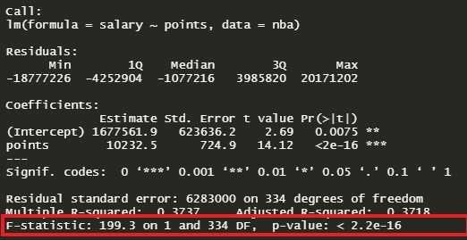

```{r setup, include=FALSE}
knitr::opts_chunk$set(echo = TRUE)
library(tidyverse)
```

Regression is an incredibly common form of analysis used by both amateurs and professionals alike. Why is that? Because it is a robust tool for understanding relationships between variables. In addition, it also allows us the ability to make predictions on previously unseen data. Most people, at one time or another, have taken a statistics course and have run a simple linear regression model either in Excel or a programming language like R or Python. I venture to say that most people, given some model output, could pick out the y-intercept and the variable coefficients, but what about all the other data that is returned when we run a model?

{width="405"}

> *Are there other things we should consider? What do the other values tell us?*

## The Data

We will perform a deep dive into each of the above metrics with the goal of deeply understanding what each metric is telling us about the model, as opposed to the nuts and bolts of how to calculate each number. To do this, we'll be using a [dataset](https://www.kaggle.com/koki25ando/salary) from the National Basketball Association (NBA) that includes salary information and points scored during the season for each player in the 2017-2018 season. We'll be investigating the relationship between points scored in a season and the salary of a player. Below is a preview of the dataset:

{width="333"}

## Simple Linear Regression Output

```{r message=FALSE, warning=FALSE, include=FALSE}
nba <- readr::read_csv('https://raw.githubusercontent.com/christianthieme/Business-Analytics-and-Data-Mining-with-Regression/main/nba_data.csv') %>% rename(points = PTS, salary = salary_2017_in_millions)

model <- lm(salary ~ points, data = nba)
summary(model)
```

We'll start by running a simple regression model with `salary` as our dependent variable and `points` as our independent variable. The output of this regression model is below:

{width="549"}

Now that we have a model and the output, lets walk through this output step by step so we can understand each section and how it helps us determine the effectiveness of the model.

## Call

{width="389"}

The call section shows us the formula that R used to fit the regression model. Salary is our dependent variable and we are using points as a predictor (independent variable) from the NBA dataset.

## Residuals

{width="389"} 

The residuals are the difference between the actual values and the predicted values. We can generate these same values by taking the actual values of salary and subtracting it from the predicted values of the model:

```{r}
summary(nba$salary - model$fitted.values)
```

So how do we interpret this? Well, thinking critically about this, we'd definitely want our median value to be centered around 0 as this would tell us our residuals were somewhat symmetrical and that our model was predicting evenly at both the high and low ends of our dataset. Looking at the output above, it looks like our distribution is somewhat symmetrical, but also slightly right-skewed. This tells us that our model is not predicting as well at the higher salary ranges as it does for the low ranges. We can visualize this with a qq plot. Looking at the chart below, you can see there are outliers on both ends of the chart, but those on the upper end look more severe than those on the bottom. Overall the residuals look to have a fairly normal distribution.

```{r}
plot(model, c(2))
```

## Coefficients

{width="389"}

To understand what the coefficients are, we need to go back to what we are actually trying to do when we build a linear model. We are looking to build a generalized model in the form of $y=mx+b$, where $b$ is the intercept and $m$ is the slope of the line. Because we often don't have enough information or data to know the exact equation that exists in the wild, we have to build this equation by generating estimates for both the slope and the intercept. These estimates are most often generated through the ordinary least squares method, which is a fancy term for saying that the regression model finds the line that fits the points in such a way that it minimizes the distance between each point and the line (minimizes the sum of the squared differences between the actual values and the predicted values).

{width="389"} 

#### Coefficients - Estimate

It is from this line above that we obtain our coefficients. Where the line meets the y-axis is our intercept ($b$) and the slope of the line is our $m$. Using the understanding we've gained so far and the estimates for the coefficients provided in the output above, we can now build out the equation for our model. We'll substitute `points` for $m$ and `(Intercept)` for $b$. $y=10,232.50x + 1,677,561.90$

Now that we have this equation what does it tell us? Well, as a baseline, if an NBA player scored 0 points during a season, that player would make $\displaystyle\$1,677,561.90$ on average. Then, for each additional point they scored during the season, they would make $\displaystyle\$10,232.50$.

Let's take a look at what this would look like in our own example by using the first player in our dataset, James Harden. James Harden scored 2,376 points. Using our formula, we get an estimate of:

$10,232.50(2,376)+1,677,561.90 = 25,989,981.90$

James Harden actually made \$28.3M, but you can see that we are directionally accurate here by using the coefficient estimates from the model.

#### Coefficients - Std. Error

The standard error of the coefficient is an estimate of the standard deviation of the coefficient. In effect, it is telling us how much uncertainty there is with our coefficient. The standard error is often used to create confidence intervals. For example we can make a 95% confidence interval around our slope, `points`, by taking $\displaystyle\$10,232.50\pm 1.96(\displaystyle\$724.90) = (\displaystyle\$8,811.70,\displaystyle\$11,653.30)$.

Apart from being helpful to compute confidence intervals and t-values, it can be a quick way to check if the coefficient is significant to the model. If the coefficient is large in comparison to the standard error, then statistically, the coefficient will most likely not be 0.

#### Coefficients - t value

The t-statistic is simply the coefficient divided by the standard error. In general, we want our coefficients to have large t-statistics, because it indicates that our standard error is small in comparison to our coefficient. Simply put, we are saying that the coefficient is *X* standard errors away from zero (In our example the points coefficient is 14.12 standard errors away from 0, which statistically, is really far). What we are saying here is that the larger our t-statistic is, the more certain we can be that the coefficient is **not** zero. The t-statistic is then used to find the p-value. 

#### Coefficients - p-values and significance codes

The p-value is calculated using the t-statistic from the T distribution. The p-value, in association with the t-statistic, help us to understand how *significant* our coefficient is to the model. In practice, any p-value below 0.05 is usually deemed as *significant*. What do we mean when we say significant? It means we are confident that the coefficient is **not** zero, and in saying that, that the coefficient does in fact add value to the model in helping to explain the variance within our dependent variable. In our model, we can see that the p-values for the `intercept` and `points` is *extremely* small. This leads us to conclude that there is strong evidence that the coefficients in this model are **not** zero. 

The coefficient codes give us a quick way to visually see which coefficients are significant to the model. To the right of the p-values you'll see several asterisks (or none if the coefficient is not significant to the model). The number of asterisks corresponds with the significance of the coefficient as described in the legend just under the coefficients section. The more asterisks, the more significant. 

## Residual Standard Error

{width="389"} 

The residual standard error is a measure of how well the model fits the data. Let's return to the example shown in the sections above:  

{width="389"}

If we look at the least-squares regression line, we notice that the line doesn't perfectly flow through each of the points and that there is a "residual" between the point and the line (shown as a blue line). The residual standard error tells us the *average* amount that the actual values of Y (the dots) differ from the predictions (the line) in units of Y. That being said, for the best model, we want the smallest residual standard error possible, because that means our prediction line is very close to the actual values, on average. 

For our current model, we can see that on average, the actual values are ~\displaystyle\$6.3M away from the predicted values (regression line). Now, understanding our dataset, and that the largest salary is $28.3M, having all our predictions be off on average by \displaystyle\$6.3M won't produce a very effective model. 

## Multiple R-squared and Adjusted R-squared

{width="389"} 

The Multiple R-squared value is most often used for simple linear regression (one predictor) and tells us what percentage of the variation within our dependent variable that the independent variable is explaining. In other words, its another method to determine how well our model is fitting the data. In the example above, points explains ~37.37% of the variation within salary, our dependent variable. This tells us that points, explains some of the variation within salary, but not enough, and that our model isn't fitting the data very well (we saw this when looking at the residual standard error).

The Adjusted R-squared value is used when running multiple linear regression and can conceptually be thought of in the same way we described Multiple R-squared. The Adjusted R-squared value tells us what percentage of the variation within our dependent variable that all of the predictors are explaining. The difference between these two metrics is a nuance in the calculation where we adjust for the variance attributed by adding multiple variables.   

It's important to note that the $R^2$ value (Multiple or Adjusted) is not fool-proof and shouldn't necessarily be used alone just by virtue of how the value is calculated. For example, your Adjusted R-squared value can increase as you add additional predictors, even if they aren't related to your dependent variable in any way.   

## F-statistic and p-value

{width="389"} 

When running a regression model, either simple or multiple, a hypothesis test is being run on the global model. The null hypothesis is that there is no relationship between the dependent variable and the independent variable(s) and the alternative hypothesis is that there is a relationship. Said another way, the null hypothesis is that the coefficients for all of the variables in your model are zero. The alternative hypothesis is that at least one of them is **not** zero. The F-statistic and overall p-value help us determine the result of this test. Looking at the F-statistic alone can be a little misleading depending on how many variables are in your test. If you have a lot of independent variables, it's common for an F-statistic to be close to one and to still produce a p-value where we would reject the null hypothesis. However, for smaller models, a larger F-statistic generally indicates that the null hypothesis should be rejected. A better approach is to utilize the p-value that is associated with the F-statistic. Again, in practice, a p-value below 0.05 generally indicates that you have at least one coefficient in your model that isn't 0. We can see from our model, the F-statistic is very large and our p-value is so small it is basically zero. This would lead us to reject the null hypothesis and conclude that there is strong evidence that a relationship does exist between salary and points. 

## Conclusion

Having made it through every section of the linear regression model diagnostics in R, you are now ready to confidently jump into any regression analysis. Good luck!


## References

* [Interpreting Regression Output](https://dss.princeton.edu/online_help/analysis/interpreting_regression.htm)

* [Interpreting the Standard Error of Linear Regression Output](https://stats.stackexchange.com/questions/287862/interpreting-the-standard-error-of-linear-regression-output)

* [Explaining the lm Summary in R](http://www.learnbymarketing.com/tutorials/explaining-the-lm-summary-in-r/)

* [Interpreting Model Output In R](https://feliperego.github.io/blog/2015/10/23/Interpreting-Model-Output-In-R)

* [Residual Standard Deviation/Error: Guide for Beginners](https://quantifyinghealth.com/residual-standard-deviation-error/)