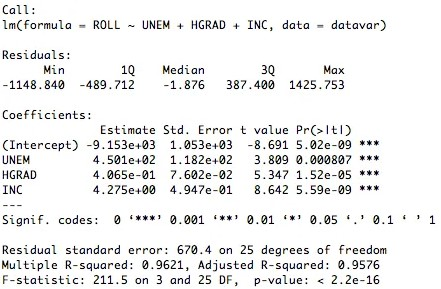
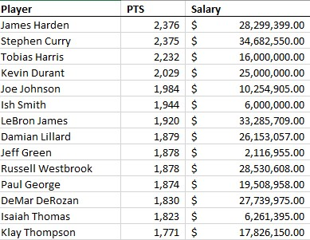
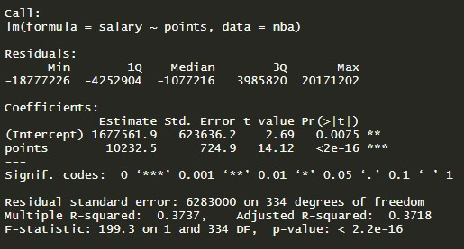
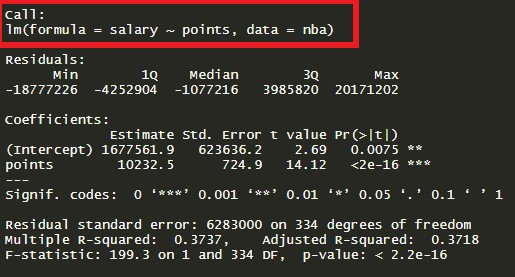
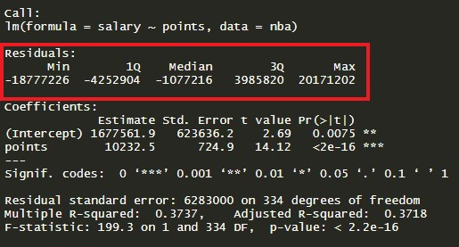
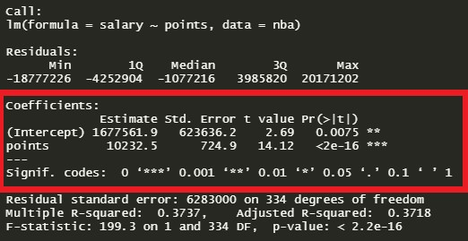
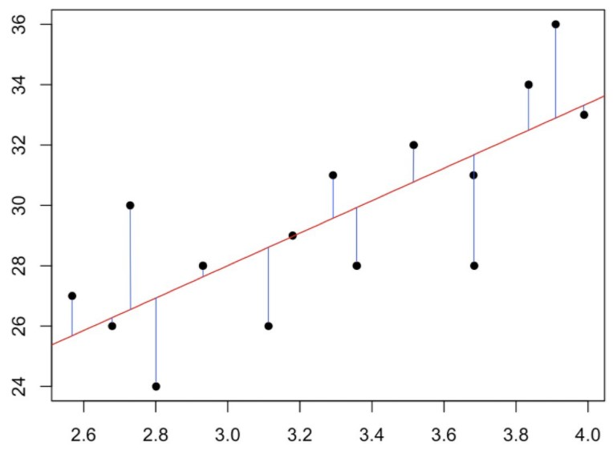

```{r setup, include=FALSE}
knitr::opts_chunk$set(echo = TRUE)
library(tidyverse)
```

Regression is an incredibly common form of analysis used by both amateurs and professionals alike. Why is that? Because it is a robust tool for understanding relationships between variables. In addition, it also allows us the ability to make predictions on previously unseen data. Most people at one time or another have taken a statistics course in their lifetime and have run a simple linear regression model either in Excel or a programming language like R or Python. I think most people, given some model output, could pick out the intercept and the variable coefficients and maybe even the $R^2$ value, but what about all the other data that is returned when we run a model?

{width="405"}

*Are there other things we should consider? What do the other values tell us? Let's find out.*

## The Data

We will perform a deep dive into each of these metrics with the goal of deeply understanding what each metric is telling us about the model, as opposed to the nuts and bolts of how to calculate each number. To do this, we'll be using a [dataset](https://www.kaggle.com/koki25ando/salary) from the National Basketball Association (NBA) that includes salary information and points scored during the season for each player in the 2017-2018 season. We'll be investigating the relationship between points scored in a season and the salary of a player. Below is a preview of the dataset:

{width="333"}

## Simple Linear Regression Output

```{r message=FALSE, warning=FALSE, include =  FALSE}
nba <- readr::read_csv('https://raw.githubusercontent.com/christianthieme/Business-Analytics-and-Data-Mining-with-Regression/main/nba_data.csv') %>% rename(points = PTS, salary = salary_2017_in_millions)

model <- lm(salary ~ points, data = nba)
summary(model)
```

We'll start by running a simple regression model with `salary` as our dependent variable and `points` as our independent variable. The output of this regression model is below:

{width="549"}

Now that we have a model and the output, lets walk through this output step by step so we can understand each section and how it helps us determine the effectiveness of the model.

## Call

{width="389"}

The call section shows us the formula that R used to fit the regression model. Salary is our dependent variable and we are using points as a predictor (independent variable) from the nba dataset.

## Residuals

{width="389"} The residuals are the difference between the actual values and the predicted values. We can generate these same values by taking the actual value of salary and subtracting it from the predicted values of the model:

```{r}
summary(nba$salary - model$fitted.values)
```

So how do we interpret this? Well, thinking critically about this, we'd definitely want our median value to be centered around 0 as this would tell us our residuals were somewhat symmetrical and that our model was predicting evenly at both the high and low ends of our dataset. In looking at this section we get a quick snapshot of how far off our model is at its worst (on both extremes) and on average. We also get a sense for the distribution and shape of the residuals, which helps us to determine if our model fits the data well in some situations but poorly in others. Looking at the output above, it looks like our distribution is somewhat symmetrical, but also slightly right-skewed. This tells us that our model is not predicting as well at the higher salary ranges as it does for the low ranges. We can visualize this with a histogram of the differences:

```{r}
hist(nba$salary - model$fitted.values, main = "Residual Distribution", xlab = "Difference between Actual and Predicted")
```

## Coefficients

{width="389"}

To understand what the coefficients are, we need to go back to what we are actually trying to do when we build a linear model. We are looking to build a generalized model in the form of $y=mx+b$, where $b$ is the intercept and $m$ is the slope of the line. Because we often don't have enough information or data to know the exact equation that exists in the wild, we have to build this equation by generating estimates for both the slope and the intercept. These estimates are most often generated through the ordinary least squares method, which is a fancy term for saying that the regression model finds the line that fits the points in such a way that it minimizes the distance between each point and the line (minimizes the sum of the squared differences between the actual values and the predicted values).

{width="389"} 

#### Coefficients - Estimate

It is from this line above that we obtain our coefficients. Where the line meets the y-axis is our intercept ($b$) and the slope of the line is our $m$. Using the understanding we've gained so far and the estimates for the coefficients provided in the output above, we can now build out the equation for our model. We'll substitute `points` for $m$ and `(Intercept)` for $b$. $y=10,232.50x + 1,677,561.90$

Now that we have this equation what does it tell us? Well, as a baseline, if an NBA player scored 0 points during a season, that player would make $\displaystyle\$1,677,561.90$ on average. Then, for each additional point they scored during the season, they would make $\displaystyle\$10,232.50$.

Let's take a look at what this would look like in our own example by using the first player in our dataset, James Harden. James Harden scored 2,376 points. Using our formula, we get an estimate of:

$10,232.50(2,376)+1,677,561.90 = 25,989,981.90$

James Harden actually made \$28.3M, but you can see that we are directionally accurate here by using the coefficient estimates from the model.

#### Coefficients - Std. Error

The standard error of the coefficient is an estimate of of the standard deviation of the coefficient. In effect, it is telling us how much uncertainty there is with our coefficient. The standard error is often used to create confidence intervals. For example we can make a 95% confidence interval around our slope, `points`, by taking $\displaystyle\$10,232.50\pm 1.96(\displaystyle\$724.90) = (\displaystyle\$8,811.70,\displaystyle\$11,653.30)$

Apart from being helpful to compute confidence intervals and t-values, it can be a quick way to check if the coefficient is significant to the model. If the coefficient is large in comparison to the standard error, then statistically, the coefficient will most likely not be 0.

#### Coefficients - t value

```{r}
model <- lm(sqrt(salary) ~ points, data = nba)
summary(model)
```

## References

[Interpreting Regression Output](https://dss.princeton.edu/online_help/analysis/interpreting_regression.htm)

[interpreting the standard error of linear regression output](https://stats.stackexchange.com/questions/287862/interpreting-the-standard-error-of-linear-regression-output)

[explaining the lm summary in r](http://www.learnbymarketing.com/tutorials/explaining-the-lm-summary-in-r/)

[Interpreting Model Output In R](https://feliperego.github.io/blog/2015/10/23/Interpreting-Model-Output-In-R)